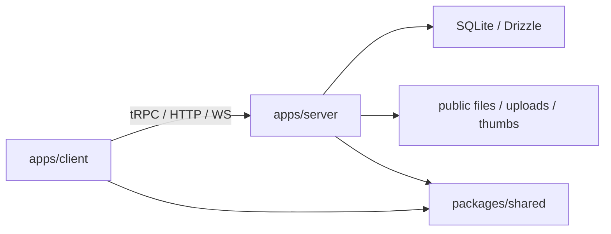

# Project Map

Последнее обновление: 2026-04-01 (reactions/sounds/avatar/reconnect docs)

Этот файл нужен как навигационная карта по репозиторию.  
Он не заменяет `AI.md`: `AI.md` хранит продуктовый и исторический контекст, а `PROJECT_MAP.md` отвечает на вопрос "где лежит код и что за что отвечает".

## Правило Обновления

- При изменении структуры папок, точек входа, публичных модулей, router-границ, shared-контрактов и крупных экранов нужно обновлять этот файл.
- При декомпозиции больших файлов нужно обновлять:
  - этот `PROJECT_MAP.md`;
  - профильный TODO/миграционный документ, если он связан с задачей;
  - `AI.md`, если поменялась стартовая точка чтения или важные архитектурные акценты.
- Для ИИ правило простое: если редактирование меняет структуру проекта или смысл модуля как точки входа, обновляй `PROJECT_MAP.md` в этой же задаче.

## Репозиторий Верхнего Уровня

- `apps/client` — production-клиент на React/Vite.
- `apps/server` — сервер Bun + tRPC + WebSocket + Drizzle/SQLite + mediasoup.
- `packages/shared` — общие типы, константы, enum, контракты между клиентом и сервером.
- `packages/ui` — UI-примитивы и общие визуальные компоненты.
- `packages/plugin-sdk` — API и контракты для plugin-слоя.
- `references/OpenCord` — reference-код OpenCord для сравнения архитектуры и UX-подходов. Не является основной кодовой базой.
- `test` — статический прототип/макет, который часто используется как визуальный эталон.
- `TODO_ROLES_USERS_MIGRATION.md` — живой документ по системе ролей/пользователей и её миграции в production.
- `AI.md` — стартовый ИИ-контекст и продуктовая история.
- `build-exe.bat` — основная сборка Windows `exe`.

## Клиент

### Точки Входа

- `apps/client/src/main.tsx` — главный вход клиента: theme, store, providers, routing.
- `apps/client/src/components/routing/index.tsx` — верхний уровень маршрутизации экранов.
- `apps/client/src/components/routing/auto-login-controller.tsx` — runtime автологина/автореконнекта, countdown следующей попытки и restore-flow.
- `apps/client/src/screens/server-view/index.tsx` — вход в экран сервера.
- `apps/client/src/screens/loading-app/index.tsx` — экран `Автоматический вход... / Ожидание подключения к серверу...` с кнопкой reload и таймером реконнекта.

### Ключевые Области

- `apps/client/src/screens/server-view/` — основной рабочий экран мессенджера.
  - `prototype-interface.tsx` — orchestration-экран prototype-слоя: сборка UI-блоков, связывание runtime-hook'ов и минимум локального glue-кода.
  - `prototype-interface.css` — основной стиль этого экрана.
  - `content-wrapper.tsx` — обёртка server-view.
- `apps/client/src/features/server/` — Redux/state-слой для серверных данных.
  - `slice.ts` — центральный серверный slice, тоже крупный и важный модуль.
  - `hooks.ts`, `selectors.ts`, `messages/*`, `channels/*`, `users/*`, `roles/*` — доступ к данным сервера и derived state.
- `apps/client/src/components/` — общие UI-компоненты production-клиента.
  - `voice-provider/` — голосовой runtime на клиенте.
  - `server-screens/` — экраны server settings / user settings.
  - `tiptap-input/` — редакторная инфраструктура и emoji/mentions плагины.

### Текущий Узкий Горлышко

- `apps/client/src/screens/server-view/prototype-interface.tsx` — всё ещё крупный orchestration-файл, но уже в основном состоит из связки runtime-hook'ов и прокидывания данных в `PrototypeSidebar` / `PrototypeChatPanel` / `PrototypeComposer` / `PrototypeSettingsModal`.
- Для него введён локальный модульный слой:
  - `apps/client/src/screens/server-view/prototype/types.ts`
  - `apps/client/src/screens/server-view/prototype/constants.ts`
  - `apps/client/src/screens/server-view/prototype/utils.ts`
  - `apps/client/src/screens/server-view/prototype/components/*`
    - `prototype-sidebar.tsx` — левая shell-часть экрана: табы, service header, поиски, список чатов, create-group button, context menu групп и user card.
    - `prototype-chat-panel.tsx` — центральная chat-панель: header, pinned popover, body сообщений и overlays.
    - `prototype-composer.tsx` — вынесенный composer UI, emoji/GIF picker, category buttons для emoji и attach modal.
    - `prototype-chat-overlays.tsx` — вынесенные chat overlays: context menu, drag overlay, scroll-to-bottom и image viewer.
    - `prototype-group-editor-modal.tsx` — модалка создания/редактирования группы: имя, описание, аватарка, фильтр видимости.
    - `prototype-message-reactions.tsx` — reaction-chip'ы под сообщением, aggregation по emoji, кнопка `+`, toggle собственной реакции.
    - `prototype-message-reaction-picker.tsx` — popup выбора emoji для реакций из контекстного меню сообщения и из кнопки `+`.
  - `apps/client/src/screens/server-view/prototype/hooks/*`
    - `use-prototype-drafts.ts` — черновики по `chatId`.
    - `use-prototype-unread.ts` — unread/read-state прослойка для prototype-экрана.
    - `use-prototype-image-viewer.ts` — состояние и zoom/pan/escape-логика просмотра изображений.
    - `use-prototype-attachments.ts` — attach modal, upload, cleanup временных файлов, drag-and-drop и paste-отправка вложений.
    - `use-prototype-pinned.ts` — pinned popover state, lazy-load закрепленных сообщений и refresh при открытом popover.
    - `use-prototype-message-context-menu.ts` — состояние, позиционирование и outside-click/escape lifecycle контекстного меню сообщения.
    - `use-prototype-message-actions.ts` — side-effects действий контекстного меню сообщения: reactions picker, quote, delete, pin/unpin и refresh pinned-поповера.
    - `use-prototype-emoji-picker.ts` — состояние emoji/gif popover, recent emoji/gif storage, outside-click/escape закрытие и debounce-загрузка GIF через Tenor proxy.
    - `use-prototype-composer-actions.ts` — действия composer-слоя: отправка текста, отправка GIF и вставка emoji в editor.
    - `use-prototype-file-download.ts` — клиентское скачивание файлов с `showSaveFilePicker` fallback'ом на обычный browser download.
    - `use-prototype-chat-scroll.ts` — scroll/jump runtime чата: scroll-to-bottom visibility, consume unread во viewport, top/bottom window paging и jump-to-message с highlight.
    - `use-prototype-chat-messages.ts` — message/channel runtime: DM channel resolution, windowed message loading, DM unread sync и базовая гидрация активного чата.
    - `use-prototype-message-realtime.ts` — realtime-подписки сообщений: `onNew/onUpdate/onDelete`, синхронизация локального message-window, unread-реакции, sound на входящее сообщение и DM refresh при входящих событиях.
    - `use-prototype-typing.ts` — typing runtime: отправка `signalTyping`, realtime-подписка `onTyping`, timeouts очистки и строка typing-indicator для DM, общей группы и кастомных групп.
    - `use-prototype-role-access.ts` — role/access runtime: гидрация server roles в settings-модель, derived permissions/limits/abilities текущего пользователя и видимый список ролей.
    - `use-prototype-settings-runtime.ts` — settings/admin runtime: state всех settings-модалок, generation flow кодов доступа для роли/пользователя, handlers edit/delete/add-role, смена своей аватарки и локальная синхронизация списка пользователей/ролей.
    - `use-prototype-composer-editor.ts` — editor runtime: `useEditor`, paste/copy emoji handling, draft sync между chat'ами и derived symbol/line counters.
    - `use-prototype-chat-catalog.ts` — derived chat-catalog runtime: список доступных контактов/групп, pinned main group, active chat, unread-индикаторы для sidebar, per-group `canManage` по фильтру и авто-возврат в безопасный чат, если группа стала невидима.
    - `use-prototype-message-presentation.tsx` — presentation-слой сообщений: grouping соседних сообщений, emoji lookup/recent groups, render текста/GIF/emoji, mentions/quotes и safe-copy текста из message body.
  - `apps/client/src/screens/server-view/prototype/settings/*`
    - `settings-modal.tsx` — вынесенный settings UI: вкладки ролей/пользователей и связанные модалки.

Эта папка предназначена для поэтапной декомпозиции экрана без немедленного раскидывания unstable-логики по всему проекту.

### Карта Интерфейса `server-view`

Ниже перечислены не просто файлы, а реальные блоки экрана и их ответственность.

- Левая колонка:
  - верхние табы `Контакты / Группы / Боты / Другое`;
  - service header с брендом `Мессенджер Коннект`;
  - поиск по контактам и группам;
  - список чатов / контактов / групп;
  - создание групп и контекстное управление группами по правому клику;
  - нижняя карточка текущего пользователя с реальной аватаркой.
- Центральная колонка:
  - header активного чата;
  - action-кнопки чата;
  - pinned popover;
  - список сообщений;
  - реакции под сообщениями;
  - вложения сообщений через `MessageFilesGrid`;
  - overlays поверх чата.
- Нижняя зона:
  - composer;
  - индикатор `кто печатает`;
  - лимиты символов и строк;
  - emoji picker;
  - category buttons для emoji;
  - GIF picker;
  - attach modal.

### Что Где Рендерится

- `prototype-sidebar.tsx`:
  - табы разделов;
  - service header;
  - оба поля поиска;
  - список сущностей слева;
  - user card.
- `prototype-chat-panel.tsx`:
  - шапка активного чата;
  - pinned popover;
  - chat body;
  - список сообщений;
  - message reactions;
  - интеграция `prototype-chat-overlays`.
- `prototype-composer.tsx`:
  - поле ввода;
  - кнопки отправки/прикрепления;
  - emoji/GIF переключатель;
  - attach modal.
- `prototype-chat-overlays.tsx`:
  - context menu сообщения;
  - drag overlay;
  - scroll-to-bottom button;
  - image viewer overlay.
- `settings-modal.tsx`:
  - все настройки ролей и пользователей;
  - связанные confirm/edit/invite модалки внутри settings-сценария;
  - редактирование собственного имени и аватарки.

### Модалки, Поповеры И Overlays

Это список всего, что открывается и закрывается отдельным состоянием.

- `isSettingsModalOpen`:
  - открывает основную модалку `Настройки`;
  - внутри нее живут вкладки `Роли / Пользователи`.
- `settingsRoleEditorOpen`:
  - открывает модалку `Добавить роль / Редактировать роль`.
- `settingsDeleteUserTarget`:
  - открывает confirm-модалку удаления пользователя.
- `settingsEditUserTarget`:
  - открывает модалку редактирования имени пользователя.
- `settingsInviteCode`:
  - открывает модалку `Код доступа`.
- `isAttachModalOpen`:
  - открывает attach modal для отправки файлов с комментарием.
- `isEmojiPickerOpen`:
  - открывает popover выбора `Смайлики / GIF`.
- `groupEditorOpen`:
  - открывает модалку создания или редактирования группы.
- `isPinnedPopoverOpen`:
  - открывает popover закрепленных сообщений активного чата.
- `messageContextMenu`:
  - открывает context menu конкретного сообщения.
- `messageReactionPicker`:
  - открывает popup выбора emoji для реакций.
- `isDragOverlayVisible`:
  - показывает overlay при drag-and-drop файлов в чат.
- `imageViewerFile`:
  - открывает fullscreen overlay просмотра изображения.

### Триггеры Открытия И Закрытия

- Шестеренка в service header и user card:
  - открывает `Настройки`.
- Кнопка `pin` в chat header:
  - открывает pinned popover.
- Изменение pin/unpin у сообщения при открытом popover:
  - триггерит refresh списка закрепов через pinned-runtime hook.
- Клик по сообщению в pinned popover:
  - переводит чат к нужному сообщению и кратко подсвечивает его.
- Правая кнопка мыши по сообщению:
  - открывает message context menu.
- Пункт `Реакции` в message context menu:
  - открывает popup выбора emoji.
- Кнопка `+` в блоке реакций:
  - открывает popup выбора дополнительной реакции для конкретного сообщения.
- Скролл чата и outside click:
  - закрывают message context menu.
- Кнопка смайлика:
  - открывает emoji/GIF popover.
- Правая кнопка мыши по группе:
  - открывает context menu группы `Редактировать / Удалить` при наличии права и совместимого фильтра.
- Outside click и `Escape` внутри emoji/GIF popover:
  - закрывают popover.
- Кнопка скрепки:
  - открывает attach modal.
- Клик по картинке во вложениях:
  - открывает image viewer.
- Drag файлов над chat body:
  - показывает drag overlay.
- Paste файлов в активный чат:
  - запускает немедленную отправку вложений без attach modal.

### Авто-Закрытие И Системные Реакции

- При потере прав:
  - settings-related окна закрываются автоматически.
- При смене активного чата:
  - pinned popover закрывается;
  - image viewer сбрасывается;
  - draft и unread логика пересинхронизируются через hooks;
  - scroll runtime ведет к первому unread сообщению или в конец чата.
- При открытии активного чата:
  - messages runtime подтягивает текущее окно сообщений и держит windowed paging для старых/новых сообщений.
- При realtime-событиях сообщений:
  - локальное окно сообщений обновляется без ручного refresh;
  - unread и DM runtime синхронизируются через отдельный realtime-hook.
- При входящем сообщении не от себя:
  - prototype также проигрывает `MESSAGE_RECEIVED`.
- При `Escape`:
  - image viewer закрывается.
- При backdrop/outside-click:
  - закрываются те модалки/поповеры, у которых это предусмотрено текущим UX.
- При несовместимости фильтра видимости:
  - активный чат автоматически закрывается и пользователь возвращается в безопасный чат.
- При смене фильтра группы:
  - пользователь, потерявший доступ, получает realtime-удаление группы из sidebar;
  - пользователь, получивший доступ, получает realtime-появление группы.

## Сервер

### Точки Входа

- `apps/server/src/index.ts` — boot sequence сервера.
- `apps/server/src/utils/create-servers.ts` — создание HTTP/WS серверов.
- `apps/server/src/utils/trpc.ts` — контекст, protected/public procedures, middleware.

### Ключевые Области

- `apps/server/src/routers/` — tRPC routers.
  - `messages/*` — отправка, редактирование, подписки, typing, загрузка истории.
- `apps/server/src/routers/messages/toggle-message-reaction.ts` — toggle реакции на сообщение; permission-gate для реакции снят, реакции разрешены всем авторизованным пользователям с доступом к сообщению.
  - `roles/*`, `users/*`, `invites/*`, `channels/*`, `dms/*` — админка, доступ, DM, каналы.
  - `users/provision-role-access.ts` — создание временного пользователя под роль + выдача одноразового кода доступа.
  - `users/issue-login-code.ts` — выдача одноразового кода входа для существующего пользователя.
  - `users/delete-user.ts` — полное удаление пользователя с каскадной очисткой истории, файлов, mentions, pins и связанных сущностей.
  - `channels/add-channel.ts`, `channels/update-channel.ts`, `channels/delete-channel.ts` — CRUD групп и каналов, включая group avatar/filter/visibility checks.
- `apps/server/src/http/` — HTTP endpoints вне tRPC.
  - `login.ts`, `upload.ts`, `info.ts`, `public.ts`, `tenor.ts`.
  - `login.ts` — главный auth entry point: bootstrap разработчика, обычный пароль, one-time access codes и first-activation flow временных пользователей.
- `apps/server/src/db/` — БД и миграции.
  - `schema.ts` — схема Drizzle.
  - `seed.ts` — первичный seed и корректировка старых баз.
  - `queries/*`, `mutations/*`, `migrations/*`.
  - `migrations/meta/_journal.json` — критичный handoff-файл для применения миграций в production `exe`; если здесь нет новых записей, live-БД не увидит новые SQL.
  - `queries/channels.ts` — фильтрация доступных каналов для пользователя, включая группы и realtime affected users.
  - `queries/files.ts` — orphan-cleanup с учетом group avatar и удаление файлов группы.
  - `publishers.ts` — pubsub-публикация каналов, включая granular `retained / gained / lost access` для групп.
- `apps/server/src/helpers/` — вспомогательная серверная логика.
  - `role-policy.ts` — нормализация limits/abilities ролей.
  - `user-visibility.ts` — фильтрация видимости пользователей/ролей и правило `canManageGroupWithFilter`.
  - `user-auth.ts` — генерация `cm-user-*` identity, issue/consume one-time login codes и bootstrap read-state для предсозданных пользователей.
  - `thumbnails.ts` — генерация thumbnail.
- `apps/server/src/utils/` — runtime-level утилиты.
  - `file-manager.ts`
  - `pubsub.ts`
  - `rate-limiters/*`
  - `env.ts`, `mediasoup.ts`, `shutdown.ts`
- `apps/server/src/crons/` — фоновые housekeeping-задачи.
  - `cleanup-files.ts` — очистка orphaned files.
  - `cleanup-pending-users.ts` — удаление временных пользователей, не завершивших активацию в TTL.

## Shared Packages

- `packages/shared/src/types.ts` — одна из главных shared-точек: общие типы, role limits, abilities, read states и транспортные контракты.
- `packages/shared/src/statics/permissions.ts` — enum permissions/channel permissions и связанные описания.
- `packages/ui` — shared UI без бизнес-логики.
- `packages/plugin-sdk` — общие plugin-контракты. Если меняются публичные plugin API, обновлять карту.

## Test And References

- `test/` — прототип/макет интерфейса, который часто используется как визуальный референс перед переносом в production.
- `references/OpenCord/` — референсная кодовая база OpenCord для сравнения поведения и архитектурных решений. Код оттуда не считается "нашим" production-слоем.

## Общие Потоки Данных

### Основные Потоки

- Авторизация: `apps/client` -> `apps/server/src/http/login.ts` -> БД/сессия/restore.
- Access-code flow:
  - `settings-modal.tsx` / `use-prototype-settings-runtime.ts` ->
  - `users.provisionRoleAccess` или `users.issueLoginCode` ->
  - `apps/server/src/http/login.ts` ->
  - `user_login_codes` / `pending_user_activations` / `users` / `user_roles`.
- Сообщения: клиентский screen/hooks -> `routers/messages/*` -> БД -> pubsub -> realtime обратно в клиент.
- Роли и ограничения: `packages/shared` типы -> `apps/server` policy helpers -> клиентский settings/prototype UI.
- Unread/read state: серверные `channel_read_states` + клиентские derived unread-индикаторы.

## Где Искать Что

- Логика входа и IP/restore:
  - `apps/server/src/http/login.ts`
  - `apps/client/src/components/routing/auto-login-controller.tsx`
  - `apps/server/src/helpers/user-auth.ts`
  - `apps/server/src/routers/users/provision-role-access.ts`
  - `apps/server/src/routers/users/issue-login-code.ts`
  - `apps/server/src/crons/cleanup-pending-users.ts`
- Основной рабочий UI мессенджера:
  - `apps/client/src/screens/server-view/prototype-interface.tsx`
- Роли, фильтры, ограничения:
  - `packages/shared/src/types.ts`
  - `apps/server/src/helpers/role-policy.ts`
  - `apps/server/src/helpers/user-visibility.ts`
  - `apps/server/src/routers/roles/*`
- Группы и фильтруемые group-channels:
  - `apps/server/src/db/schema.ts`
  - `apps/server/src/db/migrations/0014_group_channels.sql`
  - `apps/server/src/routers/channels/add-channel.ts`
  - `apps/server/src/routers/channels/update-channel.ts`
  - `apps/server/src/routers/channels/delete-channel.ts`
  - `apps/server/src/db/queries/channels.ts`
  - `apps/server/src/db/publishers.ts`
  - `apps/client/src/screens/server-view/prototype/components/prototype-group-editor-modal.tsx`
  - `apps/client/src/screens/server-view/prototype/components/prototype-sidebar.tsx`
  - `apps/client/src/screens/server-view/prototype/hooks/use-prototype-chat-catalog.ts`
- DM и unread:
  - `apps/server/src/db/queries/dms.ts`
  - `apps/server/src/routers/channels/mark-as-read.ts`
  - `apps/client/src/features/server/*`
  - `apps/client/src/screens/server-view/prototype-interface.tsx`
- Упоминания, цитаты, emoji и typing:
  - `apps/client/src/screens/server-view/prototype/components/prototype-composer.tsx`
  - `apps/client/src/screens/server-view/prototype/hooks/use-prototype-message-presentation.tsx`
  - `apps/client/src/screens/server-view/prototype/hooks/use-prototype-typing.ts`
  - `apps/server/src/routers/messages/signal-typing.ts`
- Реакции и message-sounds:
  - `apps/client/src/screens/server-view/prototype/components/prototype-message-reactions.tsx`
  - `apps/client/src/screens/server-view/prototype/components/prototype-message-reaction-picker.tsx`
  - `apps/client/src/screens/server-view/prototype/hooks/use-prototype-message-actions.ts`
  - `apps/client/src/screens/server-view/prototype/hooks/use-prototype-message-realtime.ts`
  - `apps/client/src/features/server/sounds/actions.ts`
  - `apps/server/src/routers/messages/toggle-message-reaction.ts`
- Полное удаление пользователя:
  - `apps/server/src/routers/users/delete-user.ts`
  - `apps/server/src/db/queries/files.ts`
- Автологин и реконнект UX:
  - `apps/client/src/components/routing/auto-login-controller.tsx`
  - `apps/client/src/screens/loading-app/index.tsx`
- Файлы, картинки, thumbnails:
  - `apps/server/src/http/upload.ts`
  - `apps/server/src/helpers/thumbnails.ts`
  - `apps/server/src/utils/file-manager.ts`

## Следующая Волна Декомпозиции

После `prototype-interface.tsx` следующими кандидатами на декомпозицию считаются:

- `apps/client/src/features/server/slice.ts`
- `apps/client/src/components/voice-provider/index.tsx`
- `apps/client/src/features/server/messages/hooks.ts`
- `apps/server/src/db/seed.ts`
- `apps/server/src/db/schema.ts`

Перед их распилом желательно сначала обновить этот файл и зафиксировать новую целевую структуру.

## Связанные Документы

- `AI.md`
- `README.md`
- `ROADMAP.md`
- `TODO_ROLES_USERS_MIGRATION.md`
